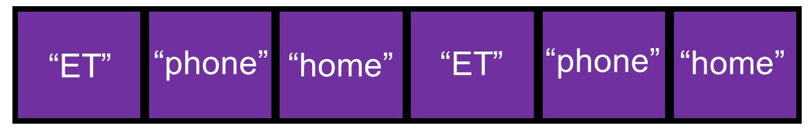
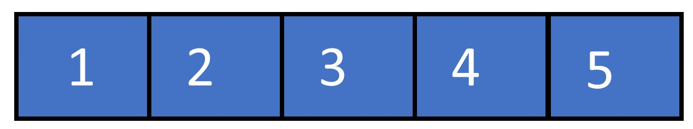
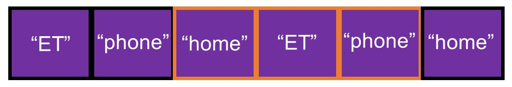
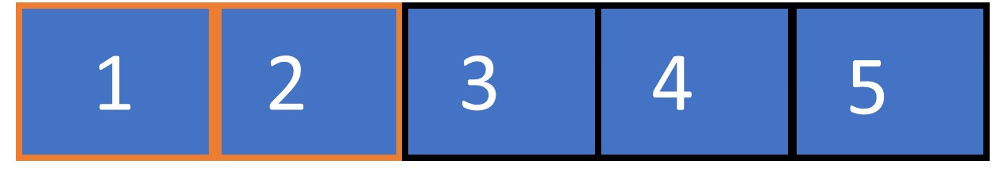
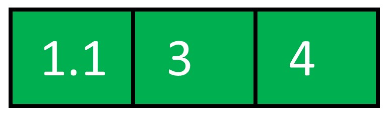
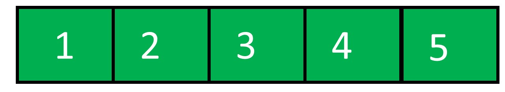
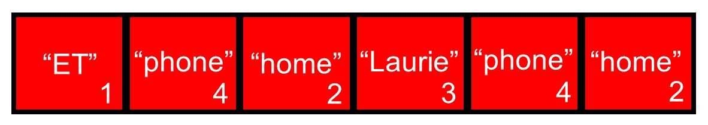
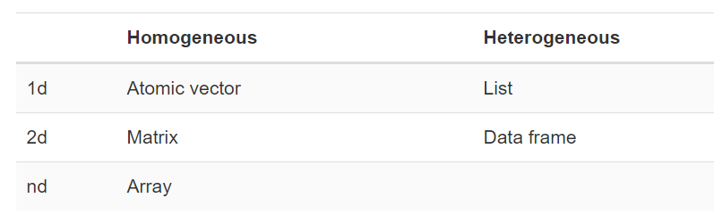
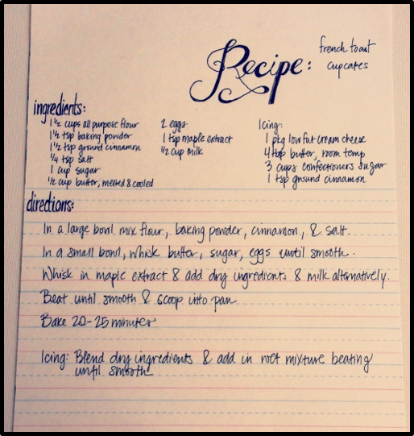
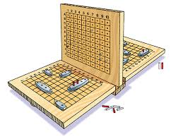

# Welcome to R!

* R is a versatile coding language for data science and it's great because:

--

1. **Free and open source** 

--

2. **Reproducibility and Reporting** 

--

3. **RStudio** 

--

4. **Graphics** 

--

5. **R Packages and Community** Over 15,000 packages on [CRAN](https://cran.r-project.org/)!

???

R is a versatile coding language for data science, with a wonderful community supporting it. Here's a short list of some of the things that make R great.


1. **Free and open source** It's a free and open source programming language and environment for statistical computing, machine learning, and graphics.

2. **Reproducibility and Reporting** writing reproducible reports is now easier than ever thanks to packages like knitr and R Markdown. 
3. **RStudio** RStudio is a powerful Interactive Development Environment that has made learning R and using R much easier. With options for workflow and project management.  
4. **Graphics.** R can be used to make great data graphics, with packages like ggplot2 helping users make graphics in an intuitive way. 

5. **R Packages and Community** With over 15,000 packages on [CRAN](https://cran.r-project.org/) alone, there’s pretty much a package to do anything. The greater R community has also expanded tremendously over time, bringing in new users and pushing R to be useful in more applications. Each year there are thousands of meetups, conferences, seminars, and workshops on R all around the world.

---
## But why should you care?

* Can use it to automate your work and make it reproducible

```{r, out.width = 700, out.height = 470, echo = FALSE, fig.align='center', fig.cap = "RAP Projects"}
knitr::include_graphics("pictures/DFID_RAP.png")
```

---
## But why should you care?

* Can use it to make meaningful visualisations of your work/programmes.

```{r, out.width = 720, out.height = 480, echo = FALSE, fig.align='center', fig.cap = "Leaflet Maps"}
knitr::include_graphics("pictures/yemen_leaflet_example_2.png")
```

---
## But why should you care?

```{r, echo = FALSE}
library(leaflet)
```


```{r}
leaflet() %>% addTiles() %>% setView(lng = 48, lat = 16.5, 6)
```


---
## Buy why should you care?

* Take advantage of the expertise of 100000s researchers/users. 

```{r, out.width = 600, out.height = 480, echo = FALSE, fig.align='center', fig.cap = "CRAN Task View"}
knitr::include_graphics("pictures/CRAN_task_view.png")
```

---

# Learning objectives: Part 1

- Familiarise yourself with RStudio and R Notebooks.

--

- Learn about R's most common data structures: **vector** and **data frame**.

--

- Explore a few of R's basic data types = **integer, character, factor, numeric**, etc. 

--

- Learn to read data into R. 

--

- Start exploring the gapminder data set.


---
class: inverse, center, middle


# RStudio and RNotebooks


---

# RStudio Settings

* First let's set it so that our notebook shows up in our viewer. 

```{r, out.width = 400, out.height = 350, echo = FALSE, fig.align='center'}
knitr::include_graphics("pictures/R_notebook_viewing.png")
```


* Now click on the little arrow next to Knit and select "Knit to HTML".

???

Click on the gear icon next to Knit on the menu. Select Preview in Viewer Pane. 


---

## RStudio

* RStudio is an interactive development environment (IDE) for R!

* **Q1**: where your script is written

```{r, out.width = 470, out.height = 390, echo = FALSE, fig.align='center', fig.cap = "From R-Ladies Sydney Basic Basics"}
knitr::include_graphics("pictures/RStudio_quadrants.jpg")
```

???

In this training we will be using RStudio. RStudio is an interactive development environment (IDE) for R and is broken down into various panels for our convenience. 

- **Q1**: script, data, command to run script
  - This is the panel you’re reading this tutorial in. It contains the script editor where we can create and edit R Notebook files, among other files.
  
  
---
## RStudio

* RStudio is an interactive development environment (IDE) for R!

* **Q2**: the console where R code is passed to and executed

```{r, out.width = 470, out.height = 390, echo = FALSE, fig.align='center', fig.cap = "From R-Ladies Sydney Basic Basics"}
knitr::include_graphics("pictures/RStudio_quadrants.jpg")
```


???

  
- **Q2**: console
  - This is the Console Panel where R code is passed to and executed.

---

## RStudio

* RStudio is an interactive development environment (IDE) for R!

* **Q3**: the environment where variables in our workspace are tracked.

```{r, out.width = 470, out.height = 390, echo = FALSE, fig.align='center', fig.cap = "From R-Ladies Sydney Basic Basics"}
knitr::include_graphics("pictures/RStudio_quadrants.jpg")
```

???

- **Q3**: environment
  - The environment tab keeps track of variables we’ve created in this workspace.

---

## RStudio

* RStudio is an interactive development environment (IDE) for R!

* **Q4**: files, plots, packages, help, viewer.

```{r, out.width = 470, out.height = 390, echo = FALSE, fig.align='center', fig.cap = "From R-Ladies Sydney Basic Basics"}
knitr::include_graphics("pictures/RStudio_quadrants.jpg")
```

???

- **Q4**: files, plots, packages, help
  - This is a multi-purpose panel which contains:
      - **Files:** A basic file explorer,
      - **Plots:** Where plots can be rendered,
      - **Packages:** install and import libraries into R,
      - **Help:** Explorer for Documentation of functions and libraries,
      - **Viewer:** View local web content e.g. Shiny app.

---

## R Notebooks

* Notebooks combine code and descriptions!


```{r Print a statement}

print('code goes here!')

```


???

R Notebooks give the opportunity to combine code and description in a single human-readable notebook. You can conduct analysis and give interpretation side-by-side! This means that your entire analytical approach can be documented together, from the raw data to the analysis and finally results and conclusions.

We can run the block of code using the play button on the right. We can also run this block of code with all previous blocks of code with the downwards facing play button in the middle. 

In some places I have added additional arguments to the code chunk (e.g. `eval = FALSE`) so that something is not evaluated in order for the html file to compile. See the example below:

Feel free to change this by simply removing the `, eval = FALSE` especially as you update the document. However, note that if there are any code errors left, the html file will not compile.  

---

## Comments and helpful shortcuts

--

* Comments are notes for you or a colleague, explaining what your code does. 

--

* Comments are added using `#`.


--

```{r Print a statement 1}

## print() is a function to print a statement

print('code goes here!')

```

--

* You can comment/uncomment using `Ctrl + Shift + C`.

--

* Execute code by placing your cursor on the line and using `Ctrl + Enter`.

???

* Your comments can be notes for yourself, or explanation of what the code is doing for someone to follow. 

* You can also comment out code you don't want to be immediately run. 

* You can comment or uncomment code using `Ctrl + Shift + C`. 

* You can run a line of code by placing your cursor anywhere on the line and using `Ctrl + Enter`. This will execute the line of code and move the cursor to the next line.

---
class: inverse, middle, center

# Basics

---

## R as a big calculator

* We can directly code into R and use it as a big calculator.

--

```{r}

5+5 

(5*12)/6 + 3

```


---

## Objects and Data Structures


* R, like other programming languages (C++, Java, C#, Python, etc.) has "object-oriented" features. 

--

* There's a major difference between R and other languages: methods are not part of object class definitions. 

--

* **objects** refer to any of the data structures we create in our environment. 

--

* We'll cover two common object data structures today: **vector** and **data frame**


---
## Objects are storage containers

--
* Let's start by making an assignment and inspecting the object we created.

```{r First R Object}

x <- 10*5

x

```

--


--

* All R statements where you create objects by making an 'assignment', take the form:

 -  `object_name <- value`

???

You can think of objects as storage containers for values. An object is created using the operator `<-`. It can be a pain to type `<-`, but don't be tempted to use `=` as this has another specific use in the R language. 

---

## **Naming objects**

* Names can include letters, numbers, periods and underscores. 

--

* Cannot start with a dot or a number `1,2,3...`. 

--

* Your name cannot contain other characters such as: "'", " " or ",". 

--

```{r Names that work for objects}

this_works <- 10*5

this_works

```

--

* This doesn't work...

```{r Names that do not work for objects, eval = FALSE}

# this_doesn't_work <- 10*5

```

--

???

You can name your objects anything. You can use letters, numbers, periods and underscores. You just can't start names with a dot or a number `1,2,3...` and your name cannot contain other characters such as a comma or a space. 

Try running the following lines of code. Try uncommenting the code `# this_doesn't_work <- 10*5` by clicking on the line and using `Ctrl + Shift + C`.

---

## What's in a name?

* Choose easy to read and descriptive object names.

--

* *Future you* and collaborators will thank you!

--

* Feeling adventurous? Try a naming convention

--

```{r Naming Conventions 1, eval = F}

jenny_bryan_and_hadley_wickham_use_snake_case 

```

--

```{r Naming Conventions 2, eval = F}

some.people.use.periods


```

--

```{r Naming Conventions 3, eval = F}

othersUseCamelCase

```


???

It is useful for **future you** and your collaborators to name your objects something that is reasonable and describes what the object contains. To make your object names easy to read it is useful to adopt a convention for demarcating words in names.

---

## Using Tab Completion to Complete Object Names

* Make a new object 

```{r Make a new object with a long name}

a_very_long_name <- 7^2 

```

* Start by typing the first few letters of `a_very...` in the code chunk below and type `TAB` to complete the name. 

```{r Using Tab to Test out the Completion Facility in RStudio, eval = FALSE}

a_very

```

???

Sometimes unavoidably to make our object names readable we use long names that can be labourious to type. Luckily, RStudio has a handy completion facility. 

Start by typing the first few letters of `a_very...` in the code chunk below and type `TAB` to complete the name. 

---

## R is case-sensitive and dislikes typos

* Let's try inspecting the object again.

```{r R is case-sensitive and does not like typos, eval = FALSE}
# What happens if you run:

a_vry_long_name

A_very_long_name

```

--
* a_vry_long_name forgets an "e"

--

* A_very_long_name the "A" is capitalized.

???
R is very sensitive to both case and spelling mistakes and won't run unless things are spelled correctly and are in the right case. If you get an error, check your spelling! More than 80% of the time, this is likely the cause of your error! 

---

## Vectors

--
* A `vector` is a 1-dimensional ordered collection of elements.

--

* the elements are **all of the same data type** (e.g. numeric).

--

* It is the fundamental data structure in R with a lot of useful properties. 

--

* We'll work with some example character and numeric vectors

```{r, out.width = 600, out.height = 100, echo = FALSE, fig.align='center', fig.cap = "Character vector"}

```


```{r, out.width = 600, out.height = 100, echo = FALSE, fig.align='center', fig.cap = "Numeric vector"}

```


## Creating a vector with `c()`

* Let's make a new vector called `character_vector` using the function `c()` which can be used to **c()**ombine elements.  

```{r Define a character vector}

## Defining the character vector:

character_vector <- c("ET", "phone", "home", "ET", "phone", "home")

```

--

```{r, out.width = 600, out.height = 100, echo = FALSE, fig.align='center', fig.cap = "Character vector"}

```


* N.B. when we specify words or characters, we use `""`.

---

## Checking the structure of the vector using `str()`

```{r Checking the structure of the character vector}

str(character_vector)

```


```{r, out.width = 600, out.height = 100, echo = FALSE, fig.align='center', fig.cap = "Character vector"}

```

* From the "" around the text, R recognises the text as a character string `chr`.


---

## Check the length of a vector using `length()`

```{r Checking the length of the character vector}

length(character_vector)

```


```{r, out.width = 600, out.height = 100, echo = FALSE, fig.align='center', fig.cap = "Character vector"}

```


---

## Extract multiple consecutive elements using `:`. 

* We can extract an element from a vector by referencing its position. 


```{r Take the 3rd and 4th and 5th elements}

character_vector[3:5]

```


```{r, out.width = 600, out.height = 100, echo = FALSE, fig.align='center', fig.cap = "Character vector"}

```

---

## Replace elements using `<-`

Try replacing the 4th element with your name:

```{r Replace an element}

character_vector[4] <- "Laurie"

character_vector
```


```{r, out.width = 600, out.height = 100, echo = FALSE, fig.align='center', fig.cap = "Character vector"}
knitr::include_graphics("pictures/character_vector_replace.jpg")
```


---

## Define a numeric vector

* The same method used to extract information works for any type of vector. 

* Let's create a new `numeric_vector` containing the numbers 1, 2, 3, 4, and 5. 


```{r Define a numeric vector}

numeric_vector <- c(1:5) 

```

--

### Check the structure using `str()`

```{r Check the structure of a numeric vector}

str(numeric_vector)

```

--

Because we have specified whole numbers, R can either classify the vector as an integer `int` or as numeric `num`.

---

## Extract the first two elements

```{r Take the first two elements from a numeric vector}

numeric_vector[1:2]

```


```{r, out.width = 600, out.height = 100, echo = FALSE, fig.align='center', fig.cap = "Numeric vector"}

```


---

## Extract non-consecutive elements using `c()`

Trying uncommenting and running the line below:

```{r We always need to use c() to specify multiple non-consecutive positions}

# numeric_vector[1,3]

```

--

Note that if we want, we can only select the 1 and 3 or 1, 3, and 4 elements using `c()`. 

```{r Use c() to specify non-consecutive positions}

numeric_vector[c(1,3:4)]

```


```{r, out.width = 600, out.height = 100, echo = FALSE, fig.align='center', fig.cap = "Character vector"}
knitr::include_graphics("pictures/numeric_non_consec.jpg")
```


---
class: inverse, center, middle


# Your Turn: Exercises Part I

---

## 1. Take the last two elements of the numeric vector

```{r Take the last two elements of the numeric vector, eval = TRUE}

## Don't know which element is the last? Use length() to find out
length(numeric_vector)

## You can use : because the positions are consecutive.

numeric_vector[4:5]

```

---

## 2. Take the first and last elements of the character_vector. 

Hint: you can use `length()` to find out how many elements there are in the character vector. 

```{r Take the first and last elements of the character_vector, eval = TRUE}

## Checking the length comes in handy here too!

length(character_vector)

## Because they are non-consecutive we need to use c()

character_vector[c(1,6)]

```

---


## A dynamically typed language

* R will try to be smart and figure out your data type for you

```{r Make a second numeric vector}

numeric_vector2 <- c(1.1,3:4)

## Check the structure

str(numeric_vector2)

```

--

```{r, out.width = 300, out.height = 100, echo = FALSE, fig.align='center', fig.cap = "Numeric vector"}

```

--

* But sometimes it gets it wrong...

* factor/character and numeric/integer are commonly wrong


???

R is what is known as a dynamically typed language. This means that unlike in other languages, where you have to set the data type when you create a vector (e.g. numeric, integer), R will infer the data type for you based on what is in your vector (e.g. numeric, character, factor, logical etc.)

We can demonstrate this by making a second numeric vector, numeric_vector2.

* You'll notice that now when we check the structure, the vector is numeric (num). This is because we now have a number with a decimal place. 

* However, sometimes the data type you want to work with, and the one R infers are not the same. 
* This happens often with character/factor, integer/numeric.
You can change the data type using a range of in-built functions that enable you to convert data from one type to another. 

---

## The `as.` functions: integer to numeric


* The `as.` functions take the form `as.<structure>`.

--

* We want to make our vector numeric so, `<structure>` =  numeric

--

```{r Change the structure of a numeric vector using as. functions}

numeric_vector <- as.numeric(numeric_vector)

str(numeric_vector)

```


```{r, out.width = 600, out.height = 100, echo = FALSE, fig.align='center', fig.cap = "Now it's a numeric vector"}

```


???
A useful set of functions are the `as.` functions, which take the form `as.<structure>`. We can use this to specify the structure of our numeric vector to be `numeric`.


---

## The `as.` functions: character to factor

* Example 2: Change character to factor.

--

* How does a character differ from a factor?

--

```{r Change the structure of a character vector using as. functions}

character_vector <- as.factor(character_vector)

str(character_vector)


```

--


```{r, out.width = 600, out.height = 100, echo = FALSE, fig.align='center', fig.cap = "A factor vector"}

```


* Now our vector is a`Factor` with 4 levels: "ET", "home", "Laurie", and "phone".

--

* When you create a factor it uses an integer code. "ET" is both "ET" and 1, "home" is both "home" and 2. 

--

* What would the integer codes be if instead of "Laurie" we had "Arnold"?

???

* When you create a factor it uses an integer code to represent each level. So that "ET" is both "ET" and 1, "Home" is both "Home" and 2. You'll notice that it automatically takes the alphabetic order when determining the factor levels. This means that even though "Phone" occurs 2nd in our character vector, it gets the integer code: 4. This is just a detail now, but becomes important in plotting, especially if you want to change the order in which your factors are plotted.

* Factors are especially useful if we want to group data by a factor (e.g. country) for counting or summarising. For instance, "Home" and "Phone" each occur twice, whereas "Laurie" and "ET" each only occur once. 

---

## Vectorised Language

* R is a **vectorised language.**

--

* Operations are applied to each element automatically without the need to loop through!

--

* Vectorised = Fast! Computers are optimised for these types of calculations. 

--

* Can mutiply, divide, add, and subtract vectors of the same length or multiples of the same length

???

Vectors aren't just containers for homogeneous data. As R is a vectorised language, this means operations are applied to each element of the vector automatically, without the need to loop through the vector. 

This is powerful as at a low-level as computer chips are generally optimised for these types of calculations [SIMD](https://en.wikipedia.org/wiki/SIMD).

---

## Vectorised language

* Can multiply and exponentiate vectors

```{r You can multiply and exponentiate vectors}

numeric_vector*3

numeric_vector^2

```


---

## Vectorised language

* Divide vectors of the same length

```{r Divide vectors of the same length}

x <- seq(from = 1, to = 20, by = 4)

x

numeric_vector/x

```

---

## Vectorised language

* Subtract or add vectors of the same length


```{r You can subtract vectors of the same length}

x - numeric_vector

```

---

## Many functions are designed for vectors

* **Let's calculate some simple statistics**

```{r}

mean(numeric_vector)

min(numeric_vector)

max(numeric_vector)

range(numeric_vector)

```


---
class: inverse, center, middle


# Your Turn: Exercises Part II

---

## 1. Divide the numeric_vector by 3

```{r Divide the numeric vector by 3, eval = TRUE}

numeric_vector/3

```

---

## 2. Multiply the numeric_vector by the new vector 'y'

```{r Multiply the numeric_vector by the new vector y}

y <- c(5:1)

y ## Let's see what y looks like

numeric_vector ## Let's remind ourselves what numeric_vector looks like


{{numeric_vector*y}}

```

---
## 3. Why do the following lines of code not work?


```{r Why does dividing numeric_vector by the object w not work, eval = FALSE}

w <- c(1:4)

numeric_vector/w

```


```{r Why does dividing numeric_vector by the object w not work 2, eval = TRUE}
w <- c(1:4)

## what's the length of w?
length(w)

## what's the length of the numeric_vector?
length(numeric_vector)

```

---

# Data Structures

* Data structures are defined based on their dimensions and contents.



Overview of Data Structures from the book [Advanced R by Hadley Wickham](http://adv-r.had.co.nz/Data-structures.html)

---

# CRAN, library, packages, and functions

???
So far, we've seen R's capabilities as a large calculator and also as a place for storing objects and vectors. However, it is much much more than that! One of the things that makes R amazing is the open source community surrounding it.

The R community which is made up of academics, statisticians, social and political scientists, economists, and data scientists to name a few, are responsible for authoring a wide variety of packages (>15,000) that can do a wide range of data manipulation, visualisation, and analysis tasks. 


To get your head around what CRAN, library, packages, and functions are I find it helpful to think of books. 

---

## CRAN: **C**omprehensive **R** **A**rchive **N**etwork.

- R equivalent of the British Library or Library of Congress.


```{r, out.width = 620, out.height = 540, echo = FALSE, fig.align='center', fig.cap = ""}
knitr::include_graphics("pictures/CRAN_packages_example.png")
```


???
It's like the R equivalent of the British Library or Library of Congress. It holds a copy of every package (book) and all the versions of R. 


## Library


- On your computer you'll have a local library with copies of the packages you've installed from CRAN.

- It's like your home office book shelf.

---

## Library: What's on your bookshelf?

* Click on the 'Packages' tab in the lower right hand panel (Q4 from before). 

* Packages that are loaded have a check mark in the box on the left.

```{r, out.width = 470, out.height = 430, echo = FALSE, fig.align='center', fig.cap = "From R-Ladies Sydney Basic Basics"}
knitr::include_graphics("pictures/RStudio_quadrants.jpg")
```


???
You can see what packages are in your library, a short description of what they do, and the package version. 
* The packages that are loaded have a check mark in the box on the left. As before, there are several packages that are automatically loaded each time you start an R session, e.g. `base` package.  

* Although it is possible to load and install your packages from here, I recommend using the functions shown below instead. This way, someoneelse or **future you** knows exactly what packages they need to run the analyses. 

* You should load the packages you will use at the top of your script, so that future you or your colleague knows what needs to be installed/loaded.

---

## Installing Packages on a Personal Computer

* A package needs to be installed **only once**. 

--

* Installing requires an internet connection to communicate with the CRAN server.

--

* The argument `dependencies = TRUE` will also install any packages that the package depends on.

--

* On your personal computer, you can install a package to your local library from CRAN by uncommenting and running the following:

```{r Installing packages directly, eval = FALSE}

## install.packages("tidyverse")

## install.packages("ggplot2", dependencies = TRUE)

```

--

* However, if you are on a government laptop without elevated access rights...

---

## Installing Packages on a Government Computer

* You guessed it... a **Service Desk Software Request** for any packages you want installed. 

--

* If you do install packages yourself you may get this error:

--

> *"Error: package or namespace load failed for ‘ggplot2’ in inDL(x, as.logical(local), as.logical(now), ...):
 unable to load shared object 'C:/Users/l-baker/Documents/R/win-library/3.6/rlang/libs/x64/rlang.dll':
  LoadLibrary failure:  This program is **blocked by group policy.** For more information, contact your system administrator."*

* You can fix it by **deleting your R folder** from Documents. 

???
* As a standard user, you are unable to run R packages that you download as it installs them to your Documents folder. Because of restrictions on the government laptops, it is then unable to run the package from this location because the DLL files it contains are blocked.

* As a result, the R installation often comes with many of the packages you'll need pre-installed. For any other packages you wish to install, you can put in a Service Desk request. 

If you do try to install packages and if you get the above error you can fix it by **deleting your R folder from Documents**. R will then return to looking for packages that come supplied with your department's R distribution. 

---

## Loading packages

* To use a package you need to load it to your workspace each time you start a new RStudio session or project. 

--

```{r Importing Packages, eval = TRUE}

library(tidyverse)

```

* Think of it as taking the book off the shelf and opening it to use.

???

In order to use the package you need to load it to your workspace. This needs to be done each time you start a new RStudio session or project. Think of it as taking the book you will use off your book shelf to place next to you on the desk.

In this case, `tidyverse` is a meta-package, which actually contains several individual packages including `dplyr`, `forcats`, etc., but more on those later. The `tidyverse` metapackage is in your library already so we can simply make a call to load them. 

Alas, there are not enough names to make each function in every package unique. The "Conflicts" line that is printed tells us that the `dplyr` function `filter` will mask the `stats` package function `filter`. 

If we want to be completely accurate, we can specify the package and function using the following form `<package_name>::<function_name>`, e.g. `dplyr::filter()`. 

If we follow the recipe book analogy, this is like saying we want the lasagna recipe from `jamie_oliver::lasagna` so that it isn't confused with the `nigella_lawson::lasagna` recipe.  

---

## Library vs install

```{r, out.width = 550, out.height = 400, echo = FALSE, fig.align='center', fig.cap = "Install vs library"}
knitr::include_graphics("pictures/install_vs_library.jfif")
```

---

## Packages

```{r, out.width = 230, out.height = 350, echo = FALSE, fig.align='center', fig.cap = ""}

```

* Each package is designed to do a specific set of tasks 
    * (e.g. data manipulation, implement linear models, etc.).

--

* Each task is implemented using a **function**.

???

You can think of a package like a book on a particular subject. Each **package** is designed to do a specific set of tasks (e.g. data manipulation, implement linear models, draw geographical maps, etc.). Each task is implemented using a **function**, which is a set of statements organised to complete the task. 

---

## Functions

```{r, out.width = 400, out.height = 400, echo = FALSE, fig.align='center', fig.cap = "From R-Ladies Sydney Basic Basics"}

```


* The function takes **arguments** (e.g. ingredients) and then carries out a **series of steps** (e.g. directions) to carry out a task.

---

## Functions

* Some **arguments** are optional (e.g. add or don't add cinnamon).

--

* other arguments are required (e.g. the cupcake requires flour!).

```{r, out.width = 470, out.height = 390, echo = FALSE, fig.align='center', fig.cap = "Required arguments"}
knitr::include_graphics("pictures/required_arguments.jpg")
```


???

A function is like a recipe from a book. It is designed to make one specific thing, e.g. cupcakes or steak and kidney pie. The function takes arguments (e.g. ingredients) and then carries out a series of steps where the ingredients are modified, cooked, combined, etc. to create the final recipe. 

Some of these arguments will be optional (e.g. add or don't add cinnamon), whereas other arguments will be required for the function to run (e.g. you can't make the cake without flour!).

---
## Functions

Functions follow the form:

* `functionName(argument1 = value1, argument2 = value2, and so on)`

--

Let's take a look at `seq()`, which makes regular sequences of numbers.

--

* Type `se` and hit TAB. A pop up shows you possible completions. 

```{r Autocompleting using TAB, eval = FALSE}

se

```

--

* select `seq` from the drop-down menu or complete the name with more typing. Add the numbers "1,10" and run the function.

--

```{r Using the function seq}

seq(1,10)

```

???
Let’s try using `seq()` which makes regular sequences of numbers and, while we’re at it, demo more helpful features of RStudio.


* Specify seq() by typing more to specify the function or using the up/down arrows to select. Doing this, you'll notice the floating help box that pops up to remind you of the function’s arguments. 

* If you want even more help, press F1 as directed to get the full documentation in the help tab of the lower right pane. 
You can also access the help file for a function by typing `?seq`. 

* Now open the parentheses and notice the automatic addition of the closing parenthesis and the placement of cursor in the middle. Type the arguments 1, 10 and hit return. RStudio also exits the parenthetical expression for you.

---
## Help files: `seq()`


```{r Helpfile for seq(), eval = FALSE}

?seq

```


```{r, out.width = 550, out.height = 430, echo = FALSE, fig.align='center', fig.cap = "Help file"}
knitr::include_graphics("pictures/Seq_helpfile.png")
```


???

Every help file will have a series of sections describing what the function does. I generally focus first on: **Description**, **Usage**, **Arguments**, and **Examples**. 

* **Description**

For example, in the helpfile for `seq()` under **Description**, it tells us it is a function to "Generate regular sequences". 

* **Usage**

We can see that `seq()` takes the arguments `from`, `to`, and `by`, and the optional arguments `length.out` and `along.with`. 

* **Arguments**

Here, we can find out what these arguments are:

  - `from, to`: the starting and maximal end values of the sequence.
  - `by` number: increment of the sequence.
  
In the code we used above in sequence, we generated a sequence of numbers `from` 1 `to` 10. In this case we did not supply a value for `by`, so it took the default value, which in this case is 1.

---

## How are function arguments resolved?

What happens if we try:

```{r How are function arguments resolved part 1, eval = T}

seq(10,1)

```

--

And what about:

```{r How are function arguments resolved part 2, eval = T}

seq(to = 10, from = 1)

```

--

R resolves **first by name and then by position**

???

The above demonstrates something about how R resolves function arguments. You can always specify in `name = value` form. But if you do not, R attempts to resolve by position. 

So above, first it is assumed that we want a sequence from = 1 that goes to = 10. Then if we swap the numbers it is assumed we want to sequence from = 10 that goes to = 1. If we name the arguments explicitly using `name = value`, the order of the arguments doesn't matter. 

---
## Printing objects and viewing your workspace

* To store our output and see it in the same line, we can use:

```{r Storing and printing objects using parentheses, eval = TRUE}

(y <- seq(from = 1, to = 10))

```

--

* We can look at our workspace using `ls()`.  
```{r Use ls() to see what is in your workspace, eval = FALSE}

ls()

```

--

* Remove the vector name `y`:

```{r Removing vectors using rm(), eval = FALSE}

rm(y)

```

--

* Remove everything using:

```{r Remove everything using rm() and ls()}

rm(list = ls())

```

???
Let's take a look at our workspace and showcase a function that doesn't require any arguments. 

You may want to do this at the end of an analysis before you start on another project. 

---

# Data frames and tibbles

* Data frames are essentially rectangular, spreadsheet-like data.

--

* Data frames can hold **variables** of different types.

--

* Each column of data is like a vector (e.g. **GDP:** numeric vector; **Country:** character vector, etc.)

--

* Many functions are set up to take data frames for their `data =` argument.

--
* `dplyr` and `ggplot2` work with a special type of data frame, called a `tibble`.

-- 

* We'll be working with the [gapminder](http://www.gapminder.org/data/) dataset from the website and [`gapminder` package](https://github.com/jennybc/gapminder) by Jenny Bryan.

???

Anytime your data is rectangular, spreadsheet-like data, the default data format in R is a data frame. Data frames can hold variables of different types. Where each column of the data, is essentially a vector, such as numeric data (GDP), character data (country name), and categorical information (infected vs. uninfected). 

Data frames are extremely useful and many functions are set up to take a data frame for the `data =` argument. The `tidyverse` packages, which include `dplyr` and `ggplot2` work with a special type of data frame, called a "tibble".


Our data comes from the Gapminder foundation, an organization dedicated to educating the public by using data to dispel common myths about the so-called developing world. The dataset we will use is one that has been combined from the gapminder data set from the `gapminder` package, and the gapminder data set from the `dslabs` package. 

---

## Gapminder: Quick Poll 1

Which country do you think had the highest infant mortality rates in 2007? Which pairs do you think are the most similar?

1. Sri Lanka or Turkey

2. Poland or Malaysia

3. Pakistan or Vietnam
---

## Gapminder: Quick Poll 2

Which of the two pairs of countries do you think had the highest life expectancy in 2007. Which are the most similar?

1. South Africa or Yemen

2. Chile or Hungary

--

## Gapminder: Quick Poll 3

For the two pairs of countries below, which country do you think had the highest gdpPercap in 2007?

1. Switzerland or Kuwait

2. Colombia or Nepal

---

## Reading in the data

Before you read in a data file you want to ask yourself two questions:

1. What type of file is it?
2. Where is the file stored?

In this case, we are going to read in a `.csv` (comma separated value) file called `gapminder.csv`. 

--

The tidyverse has several useful functions!

--

 * `read_csv`: reads in a csv file

--

 * `read_excel`: from the `readxl` package reads in an excel file (.xls and .xlsx). 
--

 * Possible to add the sheet number or name you wish to extract. 
 * Check out the arguments in the helpfile using `?read_excel`. 

???

and much, much, more! If you are looking for another file type I highly recommend checking out this section from Jenny Bryan's UBC stats course [Stat545 Import and Export](https://stat545.com/import-export.html) or looking more generally into the `readr` package. There are nice options for removing lines of meta data (e.g. rambles at the head of an excel spreadsheet) and other options for messier data frames.

---
 
## Reading in the data using the `read_` functions

The functions for reading in the data take the same basic form
 
```{r Layout of the read functions, eval = FALSE}

my_file <- file.path("../data", "gapminder.csv")

gapminder <- read_csv(file = my_file)

```

* First you need to specify the **name of the data frame** you want to store your data in. 
  * my_file

* Then the file name and location
  * read_csv(file = ".csv")
  * read_excel(path = ".xlsx")


???

In this case the file is stored in the folder "data" which is part of the IntroR course master folder you were sent. Here, you'll notice that we are using a relative path, that is the location of the data is specified in relation to our script file. Relative paths are especially useful because they will work across all operating systems and unlike a "hard path", e.g. C:/Users/l-baker/repos/The_faculty/IntroR4IntlDev", this relative path will work on anyone's computer, not just my own! 

For a 'relative path' to work, we need to get to the right directory (location where our script file is stored). You can do this using the RStudio menu: 

* "Session -> Set Working Directory -> To Source File Location". In this case this will set the working directory to the location where the script file: "IntroR4IntlDev.Rmd" is stored. 

* Alternatively, you can use `setwd("C:/Users/l-baker/repos/The_faculty/IntroR4IntlDev")` and give it the file path where your script file is located.

* To find out where you are you can use the function `getwd()` which stands for "get working directory".

```{r Working directories, eval = FALSE}

getwd()

```


## Specifying Paths: Good practice 

One of the good practices of coding is to never use absolute or "hard paths". Just because your script tells a colleague what subfolder the data is kept in on your computer, does not help them reproduce the code, especially as a hard path only works for your computer. 

The advantage of "relative paths" is that they will work across operating systems and across anyone's computer. For each project, it is best practice to set up a folder for that project with your script file and subfolders to store the "figures" and the "data".

In sharing code, you share the whole master folder complete with the figure and data subfolders. Then as long as they set the working directory to the location of your script file, they can run your script with little trouble accessing the figures and data needed from the relative paths specified. 

---

## Exploring the Gapminder Data

```{r Read in the file gapminder}

my_file <- file.path("../data", "gapminder.csv")

gapminder <- read_csv(file = my_file)

```

???

The data contains 8 columns

* country
* continent
* year
* lifeExp. Life expectancy in years. 
* pop. Country population
* gdpPercap. GDP per capita according to World Bankdev.
* infant_mortality. Infant deaths per 1000.
* fertility. Average number of children per woman.

---
## Getting to know the data


 * `View()`: allows us to view the data frame as a spreadsheet.

--
 
 * `nrow()`: tells us the number of rows in our data frame.

--

 * `names()`: gives us the names of the columns in our data frame.

--

 * `dim()`: tells us the dimensions of our data frame.

--

 * `summary()`: give us summary statistics (counts, min, median, mean, max). 

--

 * `head()`: gives us the first 6 elements of the data.

--

 * `tail()`: gives us the last 6 elements of the data.

--

 * `str()`: tells us the variable type (e.g. Factor, num (number), int (integer)). 
 
--

 * `unique()`: tells us the unique elements of a variable.
---

## Using head()

Let's take a look at `head` and `View` to inspect the data more closely. 

```{r Look at the top 6 rows using head()}

head(gapminder)

```

---
## Using View()

```{r Look at the data using View(), eval = FALSE}

View(gapminder)

```


From viewing the data we can see that the data contains eight variables: `country`, `continent`, `year`, `lifeExp`, `pop`, `gdpPercap`, `infant_mortality`, and `fertility`.

---

## Checking the structure of the data using str()

```{r Check the structure of the data using str()}

str(gapminder)

```

??

We've already used `str()` to explore our vectors, we can also use it to take a look at our data frame to tell us what type of variables we have.


In this case `country` and `continent` are characters, `year`, `lifeExp`,  `pop`, `gdpPercap`, `infant_mortality` and `fertility` are numbers.

You'll notice from the preview that both `infant_mortality` and `fertility` have some NAs. NAs are commonly used to show that there is no data for a given year and variable. 

---
## Changing the character data to factors

```{r Changing gapminder characters to factors}

gapminder$country <- as.factor(gapminder$country)
gapminder$continent <- as.factor(gapminder$continent)


str(gapminder)
```

???

One of the first things we are going to do is change the columns `country` and `continent` to factors, as we can treat them as categorical variables (i.e. they indicate a category that data belongs to). We can do this using the `as.factor` function.

*You'll notice from above that we can select columns by using the dollar sign `$`.

---
## Your Turn: Exercises Part II

???
* Click "Filter" in the View menu, you can use this similarly to how you would interact with the data in Excel. 


1. What are the dimensions of the dataframe? What do each of the numbers refer to?

```{r Dataframe Dimensions, eval = FALSE}

dim(gapminder)

```

2. What are the names of the columns in the data frame?

```{r Column Names, eval = FALSE}

names(gapminder)

```

3. What are the first countries and last countries in the data frame?

```{r Head and Tail of Data, eval = FALSE}

head(gapminder)

tail(gapminder)

```

4. What is the minimum and maximum gdpPercap? How many NAs are there for fertility? How many observations do we have for Africa?

```{r Data Summary, eval = FALSE}

summary(gapminder)

```

5. What years are covered in the data frame?

```{r Unique years, eval = FALSE}

unique(gapminder$year)

```

6. How many countries are in our data frame?

```{r Unique countries, eval = FALSE}

unique(gapminder$country)

```

---

## View()

Click "Filter" in the View menu, you can use this similarly to how you would interact with the data in Excel. 

1. What was the life expectancy in Rwanda in 1952?

2. Which country had the highest infant mortality rate? What was the year?


---
## 1. What are the dimensions of the dataframe? What do each of the numbers refer to?

```{r Dataframe Dimensions A, eval = TRUE}

dim(gapminder)

```

---
## 2. What are the names of the columns in the data frame?

```{r Column Names A, eval = TRUE}

names(gapminder)

```

*Given spelling is so important in R, `names()` is a handy way to check the names of our columns. 

---

## 3. What are the first and last countries in the data frame?

```{r Head of Data A, eval = TRUE}

head(gapminder)

```

---

## 3. What are the last countries in the data frame?

```{r Tail of Data A, eval = TRUE}

tail(gapminder)

```


---

## 4. What is the minimum and maximum gdpPercap?

```{r Data Summary A, eval = TRUE}

summary(gapminder)

```

---

## 4. How many NAs are there for fertility? 

```{r Data Summary A 1, eval = TRUE}

summary(gapminder)

```

---

## 4. How many observations do we have for Africa? 

```{r Data Summary A 2, eval = TRUE}

summary(gapminder)


```

---

## 5. What years are covered in the data frame?

```{r Unique years A, eval = TRUE}

unique(gapminder$year)

```

---

## 6. How many countries are in our data frame?

```{r Unique countries A, eval = TRUE}

unique(gapminder$country)

```

---

## Extracting Information 

**Battleship**


--

* We can extract elements from a data frame by specifying the rows and columns.

* `data_frame[rows, columns]`

???

Whenever I think of R dataframes I think of the game battleship. In battleship, to strike the other opponent's ships you launch missiles by giving a row and column reference for the location to hit on your opponent's board.

Data frames are much the same. We can extract an element by specifying the rows and the columns:

---
## Selecting a single value

If we wanted to get the first value from the first row and column in the dataframe we could use:

```{r Select the first element}

gapminder[1,1]

```

---
## Selecting a whole row

If we wanted the whole first row we could use:

```{r Select the first row}

gapminder[1,]

```

Notice, that if we want to select all columns we simply add a comma and leave the column position blank.

What happens if you run the following?

```{r The wrong way to select first row, eval = FALSE}

gapminder[1]

```

---
## Selecting specific rows and columns

If we wanted the first 5 rows and the first and third columns we could use:

```{r Select the first 5 rows and first and third columns}

gapminder[1:5, c(1,3)]

```

Remember from before that if we have nonconsecutive positions, we need to use the `c()` function to **c**ombine these positions into a list. 

---
## Reference columns by name

We can also reference the column by name:

```{r Referencing the column by column name}

gapminder[1:5, c("country", "gdpPercap")]

```

Why might this be preferred to referencing columns by number?

---

## Your Turn: Exercises Part III


???

1. Extract all rows from the column `pop` and save it in a new object called `pop`

Hint: look back to how we selected row 1 and all columns. 

```{r Select the column pop , eval = FALSE}

pop <- gapminder[]

```


2. Extract the 5th row and 6th column from the dataset

```{r Extract 5th row and 6th column, eval = FALSE}

gapminder[]

```


3. **Bonus** Extract all the rows for the columns `gdpPercap` and `pop`.

Hint: look back to how we selected row 1 and all columns. 


```{r Select columns gdpPercap and pop, eval = FALSE}

gapminder[]

```


---

## 1. Extract all rows from the column `pop` and save it in a new object called `pop`

Hint: look back to how we selected row 1 and all columns. 

```{r Select the column pop A, eval = TRUE}

pop <- gapminder[, "pop"]

```

---

## 2. Extract the 5th row and 6th column from the dataset

```{r Extract 5th row and 6th column A, eval = TRUE}

gapminder[5,6]

```

---

## **Bonus**

3. Extract all the rows for the columns `gdpPercap` and `pop`.

Hint: look back to how we selected row 1 and all columns. 


```{r Select columns gdpPercap and pop A, eval = TRUE}

gapminder[, c("gdpPercap", "pop")]

```

---
## **Bonus**

4. Extract rows 5, 20, and 44 from the column `lifeExp` and save it in a new data frame called `sub_lifeExp`

```{r Extract rows 5 and 20 and 44 from col lifeExp A, eval = TRUE}

 sub_lifeExp <- gapminder[c(5, 20, 44), "lifeExp"]

```


---

class: center, middle

# Thanks!

Slides created via the R package [**xaringan**](https://github.com/yihui/xaringan).

The chakra comes from [remark.js](https://remarkjs.com), [**knitr**](http://yihui.org/knitr), and [R Markdown](https://rmarkdown.rstudio.com).
